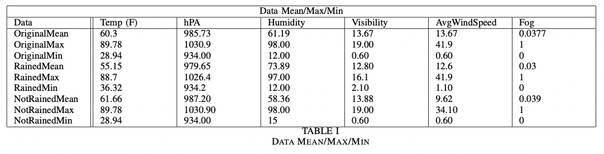
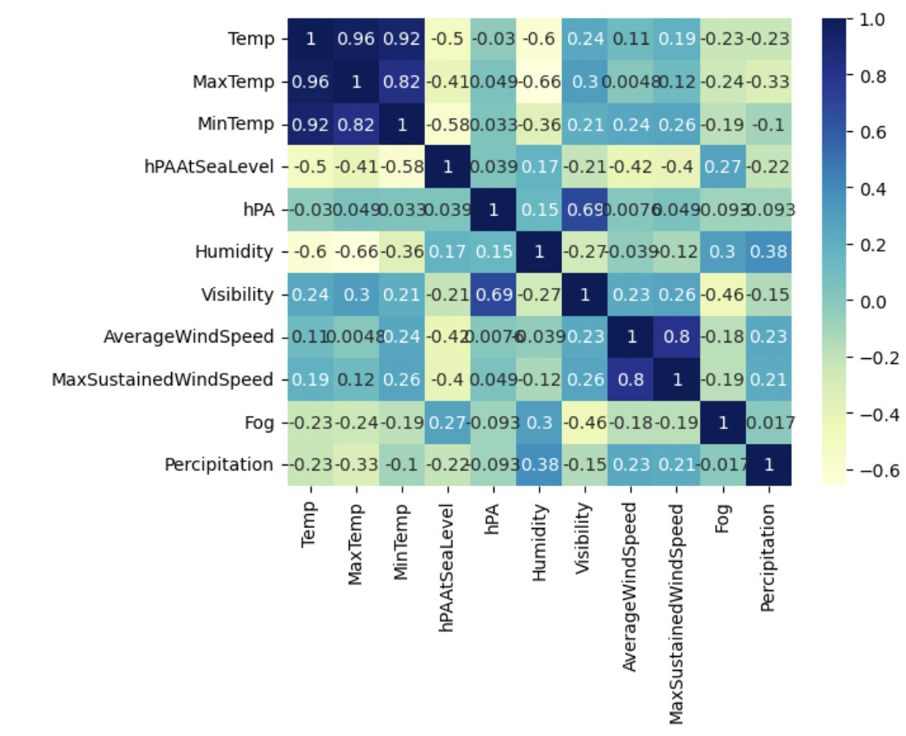
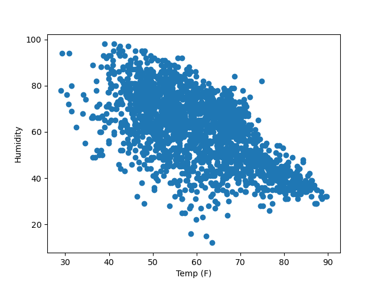
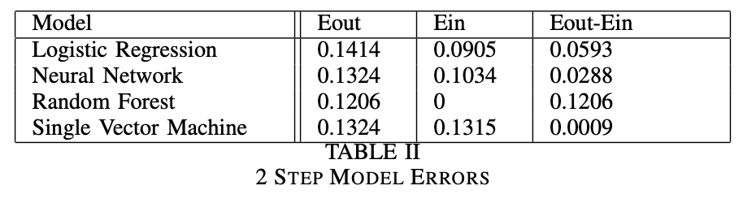

::: IEEEkeywords
component, formatting, style, styling, insert
:::

# Introduction

With the rise of big data, powerful supercomputers with Graphics
Processing Units (GPU), and scientific interest in new methods, the
beginning of the 21st century turned out to be an important time in the
history of machine learning \[1\]. However, the last few years, with
their huge increases in data volume and computer power, are seen as the
golden age of artificial intelligence and machine learning. Many
thematic articles \[2--4\] give detailed reviews of machine learning
algorithms, which are the most important type of AI method in
atmospheric science. In these books, you can find information about many
methods and how they are grouped. Scientists who study the atmosphere
found that supervised learning was the most interesting group of
techniques. This is because it is the group that has been written about
the most in recent papers in the field. If you have some data that has
been labeled, you can use it as a training set to build a function that
maps inputs to outputs. That function can be used to test the model on a
different dataset called \"testing one.\" If the results are good, it
can be used in any classification or regression application. Methods
like Decision Trees, Random Forest (RF) or XGBoost (XGB), Artificial
Neural Networks (ANN), Deep Learning (DL), and Support Vector Machine
(SVM) are in this group. On the other hand, in unsupervised learning,
algorithms don't have labeled data to train on, so they have to figure
out other ways to divide a dataset or reduce the number of dimensions.
The main purpose of this project is to give an overview of machine
learning methods and how they are used in climate analysis. We show how
machine learning techniques can be used as a new way to solve important
and complicated problems in weather forecasting and the study of climate
change over different time and space scales.Our team found a climate
dataset from 2019 to 2021 for San Jose and from 1991 to 1995 for Madrid.
We didn't want to show every part of each problem (for example, there
are at least 13 different parts of climate change, but we did want to
show the most important and interesting parts, which we found by reading
scientific papers, and show that machine learning can be used
successfully in climatology

# Methods

This section will go over the process took in terms of data processing,
data exploration, and model creation.

## Data Preparation

The dataset was obtained through combining two datasets from
tutiempo.net- San Jose weather data containing the weather outcome of
everyday from 2019 to 2021 san Jose and Madrid weather data containing
the weather outcome of everyday from 1991 to 1995 Madrid. The cumulitive
dataset size was 1989 with train-test split of 70-30.

The data used will include a variety of additional factors, such as the
highest and lowest possible temperatures, the highest and lowest
pressures at sea level, the humidity, the visibility, the average wind
speed, the maximum sustained wind speed, fog, and other variables.

The data that were collected over the course of the three years do not
correspond with one another. For instance, in a given year there may
have been an average temperature and a humidity that corresponded to
that, but there may not have been a wind speed that corresponded to that
or fog at that time. In order to get the data ready for machine
learning, we followed these steps to align the data. This was necessary
because the algorithms that power machine learning cannot effectively
deal with missing data points. We performed the following pre-processing
steps on the data: 1) Data integration: combined the weather datasets of
San Jose and Madrid 2) Data cleaning: remove missing data 3) Data
reduction: remove unnecessary features 4) Data transformation: create
new features from current ones, convert the unit of temperature, and
normalization.

Table 1

Fig. 1

Fig. 2

## Data Exploration

Before creating the model, it is important to perform data exploration
to check if there are any underlying pattern. From our analysis, we were
successfully able to confirm the existence of pattern for predicting
precipitation. The heatmap seen in Table
[1](#Heatmap){reference-type="ref" reference="Heatmap"} show there are a
lot of correlation between the features. Most notably, there are
positive correlation between humidity and wind speeds.This infers that
by high humidity and wind speeds leads to an increase in chance of
precipitation. Furthermore, there are negative correlation between
temperature, pressure at sea level, and visibility. This shows that
there are the increase in temperature, pressure at sea level, and
visibility leads to a decrease in the chance of precipitation. We can
also see the pattern between features beyond just precipitation. Based
on the heatmap Table [1](#Heatmap){reference-type="ref"
reference="Heatmap"} and the scatter plot [2](#TH){reference-type="ref"
reference="TH"}, we can see that there is a negative correlation between
temperature and humidity.

## Model Creation

For implementation of Weather Prediction we tested various models on the
dataset in order to come up with a best solution. We tested various
models such as Support Vector Machine, Logistic Regression, Random
Forest Classifier and Neural net.

We further analyzed the learning using a 2-step learning approach and
compared our results for various models. The goal here is to figure out
a model that gives the best overall results for Weather Prediction and
at the same time evaluate the results and outputs of other models.\
**2-Step Learning** There are two steps involved in learning for machine
learning tasks:

1.  $E_{out} \approx E_{in}$

2.  $E_{in} \approx 0$

where $E_{out}$ is the testing set error and $E_{in}$ is the training
set error. Step 1 is important in ensuring that the model is good at
predicting beyond the trained data, but also work well in the population
data. To decrease the error bound between $E_{out} \approx E_{in}$, we
must ensure that the dataset size is adequet, as increasing the training
data size, will decrease the bound/likelihood of error. For our case, we
set the acceptable error bound between $E_{out} \approx E_{in}$ to be
0.05. Step 2 is a optimization problem where we want to get the best
model given our training data. This step can be done by creating a good
model architecture to train on with good iteration. For our case, we
considered a model to have \"learned\" as task to have error of 0.15%.\
**Support Vector Machine** SVM is a Supervised Machine Learning
Algorithm used for classification and regression problems. It works by
finding an optimal separation line called a hyperplane to accurately
separate 2 or more different classes. The goal is to find the optimal
hyperplane separation through training the linearly separable data with
the SVM algorithm. **Logistic regression** A logistic regression model
predicts a dependent data variable by analyzing the relationship between
one or more existing independent variables. Logistic regression is
easier to implement, interpret, and very efficient to train. 10 models
were created using max iteration size of 1,000,000. **Neural Networks**
A simple Neural network for classification is made up of a single hidden
layer and a non-linear activation function. We have built a Neural Net
with 4 layers of 12 neurons and an activation layer. Activation
functions are mathematical equations or models that determine the output
of a neural network. Activation functions also help normalize the output
of each neuron to a range between -1, 0 and 1. We have used the Sigmoid
Function that outputs the probabilities in the range of 0 to 1. 4 models
were created using different epochs \[1,000,2,000,3,000,10,000\] with
adam optimizer **Random Forest** Random forest is basically the
combination of multiple individual decision trees to act as an ensemble.
Ensemble learning can be defined as a paradigm whereby multiple learners
are trained to solve the same problem. When it comes to classification
using Random Forests, the idea is that the combination of outputs of
mutually exclusive nodes will outperform any individual models which are
then said to be the predicted output.

Table 2

# Results

This section will cover the analysis and juxtapose the different models
created. The error results of the models can be seen in Table
[1](#2Step){reference-type="ref" reference="2Step"}. Based on the 2-step
method of step 1 error of 0.05 and step 2 error of 0.15, we determined
neural networks to be the best model for predicting precipitation.

Logistic regression and random forest was not considered to have learned
the task. For random forest, it was able to get no training error as the
model is based around branch splitting on the training data. This result
in a perfect accuracy, but have high deviance between $E_{in}$ and
$E_{out}$. Logistic regression was also not considered to have learned
due to the high deviance in $E_{in}$ and $E_{out}$. Logistic regression
needs more data to reduce this deviance.

Single vector machine and neural networks was considered to have learned
the task by having $E_{out}-E_{in}$ to be below 0.05 and $E_{in}$ to be
below 0.15. Although SVM did not have the best testing and training
error, it had an extremely low $E_{in}$ and $E_{out}$, meaning that the
model is very well generalized. SVM was able to also compete very well
against neural networks in terms of $E_{out}$, demonstrating that a
complex machine learning model is not always necessary to do good
prediction.

Neural network was considered to be the best model due having the
highest accuracy that had acceptable $E_{out}-E_{in}$. The specific
model that had the best performance was the model with epochs 10,000
which was surprising as the large epochs did not lead to the model being
over fit.

# Conclusion

In this work, we performed the supervised learning task of predicting
precipitation given the weather condition. We first cleaned the dataset
and explored it to confirm the existence of pattern. Then we created
prediction models using various techniques; specifically, neural
network, logistic regression, random forest, and single vector machine.
From our results, we determined that neural network was the best
technique on creating the model. Although the neural network model had
the best performance, it is important to understand how close the other
models were in juxtaposition to it. Random forest was able to gain
better accuracy in terms of both testing and training dataset. Logistic
regression gained a slight lead in the training accuracy. Single vector
machine only had the training error difference of 0.03 despite being a
much simpler model. This demonstrates that neural network is not always
necessary in learning. For future work, we recommend trying recurrent
neural network to see if it will improve on our basic neural network
model. We recommend this because recurrent neural networks use nodes
that create a cycle. This is useful as it allows for exhibiting temporal
dynamic behavior that is good to train on time based data.

::: thebibliography
00 Fradkov, A.L. Early History of Machine Learning. IFAC-PapersOnLine
2020, 53, 1385--1390. \[http://doi.org/10.1016/j.ifacol.2020.12.1888\]
Mahesh, B. Machine Learning Algorithms---A Review; International Journal
of Science and Research: Raipur, India, 2019.
\[http://doi.org/10.21275/ART20203995\] Dhall, D.; Kaur, R.; Juneja, M.
Machine Learning: A Review of the Algorithms and Its Applications. In
Lecture Notes in Electrical Engineering, Proceedings of the ICRIC,
Jammu, India, 8--9 March 2019; Singh, P.K., Kar, A.K., Singh, Y.,
Kolekar, M.H., Tanwar, S., Eds.; Springer International Publishing:
Cham, Switzerland, 2020; pp. 47--63.
\[http://doi.org/10.1007/978-3-030-29407-65\] Singh, A.; Thakur, N.;
Sharma, A. A Review of Supervised Machine Learning Algorithms. In
Proceedings of the 2016 3rd International Conference on Computing for
Sustainable Global Development (INDIACom), New Delhi, India, 16--18
March 2016,pp. 1310--1315.
:::
